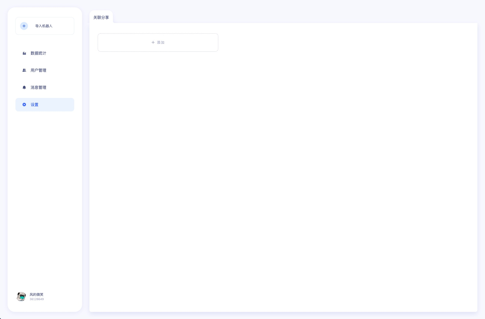
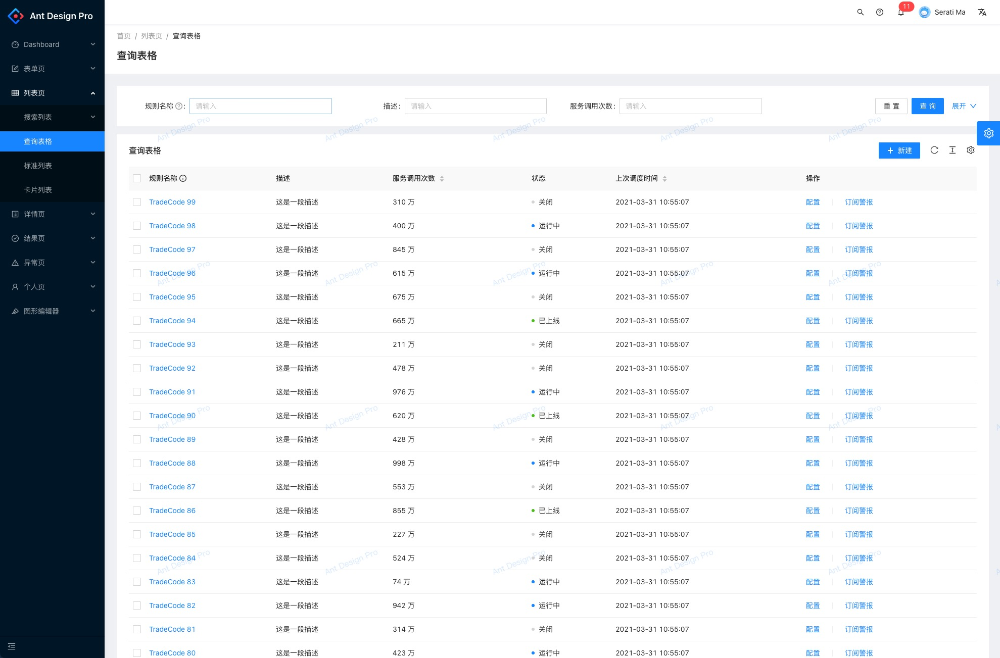

# 大群后台管理系统 - supergroup-admin

## 预期的页面结构和基本规范

### 主体结构

主体结构是一个普通的管理后台结构，左侧是主要功能列表菜单，右侧是主要的操作界面，文档后面的附录里有两个参考图

右侧的主要操作页面里，多级页面需要有 面包屑导航

### 未登录

直接提示未登录，然后跳转到
Mixin 授权登录页，流程是一个 OAuth 流程

### 登录后

> 所有功能都是需要登录授权的，如果接口 401 了就去授权登陆。

登录后默认进入群管理-群列表页

### 基本规范

> 代码清晰，结构良好可维护

1. 所有的删除，更新等等更改数据的操作，需要有一个 Dialog 二次确认的过程。
2. Table 页是指带有分页功能的行列数据表格页，需要有搜索框支持通过 group_id 过滤数据，Table 需要能够固定将某一列（操作按钮） PIN 在右侧
3. 所有的页面上需要选择用户作为输入的地方，统一是有 3 个输入选项 3 选 1，这个建议做成一个「选择用户组件」：
   1. 选择某个群的所有用户，大致是一个通过输入群号，搜索群的小组件，确认是该群之后获取该群的所有用户
   2. 提供一个多行的文本输入框，每行输入一个 user_id
   3. 文件上传，允许操作者上传一个 csv 文件

## 需求清单

> 这里的需求清单是从页面层级结构来列举的

> #后的数字是优先级排期，数字小则优先级高

- 群管理 #1
  - 群列表
    - 这是一个 Table 页
    - 最右固定展示 2 个按钮，分别是 开启/停止 群，详情
    - 开启/停止 按钮点击修改对应群的状态和切换按钮文案
    - 详情 跳转到详情页
  - 群详情页
    - 这是一个信息展示页面，展示群的各种基本信息
    - 通过群列表点击跳转过来/url 带上 groud_id 打开页面
    - 右上角需要 编辑、删除、发消息 按钮
    - 点编辑到编辑群信息页，点发消息到群发消息页
  - 新建群
    - 这是一个表单页
    - 页面上列举出来创建一个群需要的各种参数和确定按钮
  - 编辑群信息
    - 这是一个表单页
    - url 上带上 group_id
    - 页面上列举出来群的各种参数，不可修改的参数表单对应项不让修改
    - 新建群和编辑群可以使用同一个页面（比如通过带不带 group_id 区分）
  - 群发消息
    - 这是一个表单页
    - 表单包含一个文本输入框负责输入要发送的消息和选择用户组件
    - 输入完消息，选好用户，点击确认按钮群发消息
- 用户管理 #2
  - 用户列表
    - 这是一个 Table 页
    - 列表展示用户的一些基本信息，右侧是一个固定 pin 住的详情页按钮
  - 用户详情页
    - 一个信息展示页，主要是三块信息
    - 用户的基本信息，KYC 信息，银行卡列表
- 商品管理 #2
  - 商品列表
    - 这是一个 Table 页
    - 顶部需要创建商品按钮
    - 列表展示一些商品的基础信息，右侧固定两个按钮，上下架和详情
  - 详情页
    - 展示商品的各种信息
    - 右上角上下架按钮，更新商品按钮
  - 创建商品
    - 这是一个表单页
    - 页面列出来各种参数
  - 更新商品
    - 表单页，页面列出各种参数，不可修改的参数表单对应项不可修改
    - 根据传入的 product_id 获取信息，默认填到表单上
- 课程管理 #2
  - 课程列表
    - 这是一个 Table 页
    - 行右侧为删除按钮和详情页按钮
    - Table 右上角需要迁移，复制按钮
    - 迁移和复制在点击后，Table 变成复选状态，增加一个输入框和一个确认迁移/复制的按钮，输入框里输入目标群号，确认后将选中的所有课程迁移/复制到目标群里
  - 课程详情页
    - 这是一个信息展示页，展示课程的相关信息和状态
    - 右上角操作按钮为 迁移、复制、删除
    - 迁移和复制都是在点击之后，弹出一个框，输入目标群号，确认之后将本课程迁移/复制到目标群里
- 营销管理 #3
  - 一次性邀请码
    - 这是一个表单页
    - 填写一次性邀请码的各种信息，这里会有三个选择框，分别是选择商品，选择群，选择用户组件
    - 可做成多步表单的形式，但多步表单最后一步需要是 Review 所有信息和确定
    - 生成的邀请码生成一个 csv 记录到本地
    - API 目前只支持一个一个创建，多选创建生成的邀请码这里的逻辑可能需要页面起个循环去访问 API 挨个创建，然后合并生成 csv...
  - 新建优惠券
    - 优惠券有 2 种创建类型，一个是生成 N 个券码，一个是指定发给一批用户，对应的，新建优惠券会有两种表单页，或通过 Segment/Tab 按钮进行类型切换
    - 当指定发给哪些用户时，页面是通过 选择用户组件 来选择用户创建优惠券
    - 当生成一定数量券码时，是填写要生成的券码数量，创建优惠券后提供一个下载按钮，点击下载券码列表（比如一个 csv 文件）
  - 优惠券列表
    - 这是一个 Table 页
    - 需要有创建优惠券按钮
    - 行内最右侧放一个详情按钮
  - 优惠券详情
    - 这是一个信息展示页面，右上角 删除按钮
    - 主要是两块信息，优惠券的基础信息和使用优惠券的人（一个列表）
- 财务管理 #3
  - 税务管理
    - 默认页面是一个 Profit 记录 Table，Table 有个额外的查询参数是 State，3 个状态可以切换，以及不传 State 的查询（可以写 ALL 然后查的时候不传 State）
    - 右上角有个导入按钮，点击之后可以上传一个 csv，导入记录（比如弹一个 dialog，上传文件框+确认按钮）
    - Table 行上面展示具体的 profit 信息，状态，按钮根据状态展示确认计税 / 确认发放
    - 点击确认计税会触发该 profit 的计税，点击确认发放会触发数字货币的 profit 转账
  - 奖励金发放
    - 默认页面是一个 CNY Profit Records Table
    - （导出和 feedback 是单选还是多选操作待确认...但逻辑类似）
    - 单选操作：行右侧加 2 按钮，点按钮就导出或者 feedback 对应记录
    - 多选操作：Table 右上角加俩按钮，导出和 Feedback，点击之后 Table 变为可复选状态，选择完毕后点击确认进行导出/feedback
- 订单管理 #4
  - 订单列表
    - 一个 Table 页
    - 行内右侧是详情按钮
  - 订单详情
    - 信息展示页，展示订单的各种信息
- 统计信息 #4
  - 群成员统计
    - 页面是入群人数和活跃人数图表和表格数据
  - 营收统计
    - 页面是群营收图表和表格数据
  - 鼓励奖统计
    - 页面是鼓励奖统计图表和表格数据

## Millstone

> 显然这么多需求是不可能一下子都开发完的，所以会分成一些阶段

1. 授权登陆 群组管理 （可以使用，并且对群进行管理）
2. 课程管理 用户管理 商品管理 （可以对课程、用户、商品进行管理）
3. 营销管理 财务管理 （可以进行优惠券和邀请码）
4. 订单管理 统计信息

## 附录 1

> 普通的管理后台页面参考

## 附录 2

> 原 README 列举的功能点

- 群管理

  - 大群列表
    1. 获取群列表
    2. 获取单个群信息
    3. 更新群信息
    4. 停止群
    5. 开启群
  - 大群配置
    1. 获取群 properties
    2. 更新群 property
    3. 删除群 property

- 用户管理
  - 用户列表
    1. 获取群用户列表(搜索）
    2. 获取用户信息
    3. 获取用户邀请码
  - kyc 信息
    1. 获取用户 kyc 信息
  - 银行卡信息
    1. 获取用户银行卡列表
- 商品管理

  - 商品列表
    1. 获取商品列表(搜索）
    2. 创建商品
    3. 更新商品
    4. 上下架商品

- 优惠券管理
  - 优惠券列表
    1. 获取优惠券列表(搜索）
    2. 创建优惠券
    3. 删除优惠券
- 订单管理
  - 订单列表
    1. 获取订单列表 (搜索）
    2. 获取订单详情
- 课程管理
  - 课程列表
    1. 获取课程信息
    2. 更新课程信息
    3. 删除课程
  - 课程操作
    1. recover 课程 ---- 先不做 By@Lyric
    2. move 课程
    3. copy 课程
- 统计信息
  - 群成员统计
    1. 获取入群人数、活跃人数、
    2. ....
  - 群营收统计
    1. 获取群营收统计信息
  - 鼓励奖统计
    1. 鼓励奖统计
- 财务管理
  - 税务
    1. 导入 profit(比如践行群班长佣金）
    2. 触发计税
    3. 触发数字货币 profit 转账（税务转账和鼓励奖转账)
  - 鼓励奖发放
    1. 获取法币发放记录(搜索）
    2. 导出本次发放记录
    3. 反馈发放结果
